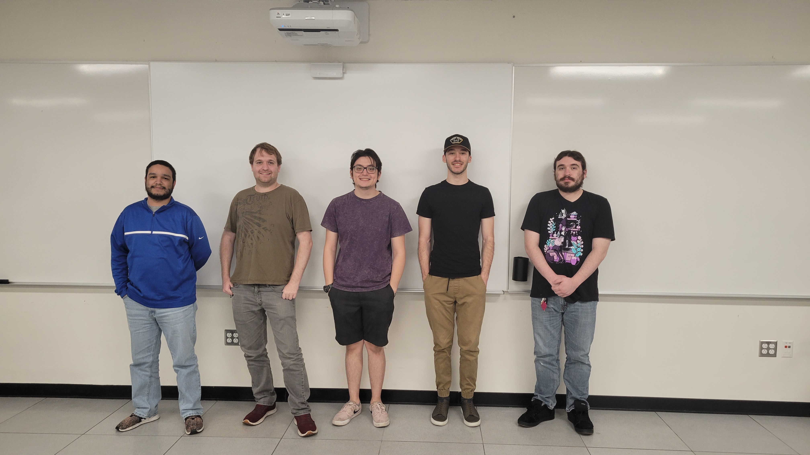

# ComputerStarter

ComputerStarter is a multimedia application that is geared towards promoting a community for computer enthusiasts. ComputerStarter has a range of topics surrounding computers such as an education section, computer build section, and blog section. The education section is used to learn how computers work as well as allowing the user to gain knowledge on individual parts and potential projects. The computer build section will allow a user to build their own computer from parts taken from reputable sources online. You can compare costs from individual parts as well as entire builds. The blog section allows the user to communicate with other users to show off their computers, ask for help or even build a community.
# Team Members (Left to Right)
|Team Member|Role|Email|
|-----------|----|-----|
|Jesus Banuelos|Team Lead|bjesusjavier@gmail.com|
|Brandon Leyden|Project Design/Slide Development|brandon.leyden.###@my.csun.edu|
|Ryan Santillan|Education Researcher|ryan.santillan.###@my.csun.edu|
|Jared Immerman|Lead Art Designer/Front-End Developer|jared.immerman.###@my.csun.edu|
|Justin Kingston|Back-End Developer/Script Writer|justin.kingston.###@my.csun.edu|

# Build Section
